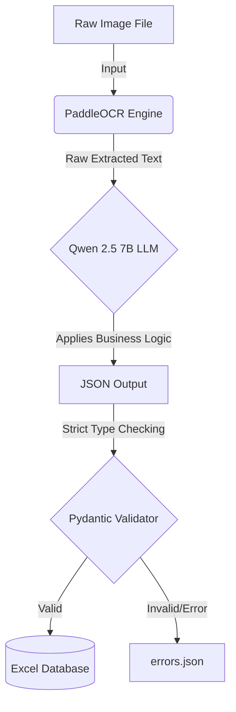

# V1: PaddleOCR + Local LLM Pipeline

This folder contains the original V1 pipeline. It was built using a two-step architecture that separates optical character recognition from logical data extraction.

## ⚙️ The Workflow

The architecture operates completely offline using local models.



## 🐛 Why it Failed on Historical Handwriting

This pipeline was archived because it struggled with **sloppy historical handwriting** and **complex table constraints**. 

1. **PaddleOCR's Stochastic Errors:** PaddleOCR would randomly hallucinate characters or merge words due to faded ink (e.g., extracting `18-03-76` as `1e18-03-76`).
2. **LLM Hallucinations (Lazy Extraction):** Because the 7B LLM was overwhelmed by complex rules and messy text, it would take shortcuts. For example, instead of extracting exact dates, it hallucinated `1965-01-01` over and over, or lazily copied the same Minute number down 200 rows rather than reading each row carefully.
3. **The Collision:** Applying strict Python logic (like checking if a date is > 1957) to hallucinated or garbled LLM outputs caused massive data corruption.

## 🚀 Best Use Case: Printed Text

While this architecture failed on historical cursive, it is the **absolute gold standard** for clean text. It is highly recommended if you are extracting data from:

* **Printed Receipts or Invoices:** Where standard fonts exist.
* **Clean, Typed Forms:** W-2s, tax documents, or modern digital PDFs.
* **Scanned Books:** Extracting structured tables or paragraphs.

For these use cases, PaddleOCR outputs 100% perfect text, meaning the LLM doesn't have to guess or hallucinate. This results in an incredibly fast, 100% free, and completely offline data extraction engine.

## 🛠️ How to Run

1. Ensure Ollama is running on your machine: `ollama serve`
2. Ensure you have the `qwen2.5:7b-instruct-q4_K_M` model downloaded.
3. Place images in `images/test_batch/`.
4. Run the pipeline:
   ```bash
   python pipeline.py
   ```
5. Results will be saved in `output/results_fixed.xlsx`.
